#  easein

    

> "The secret of getting ahead is getting started. The secret of getting started is breaking your complex tasks into small manageable tasks, and then starting on the first one." - *Mark Twain (with a productivity hack)*

---
## Website live at https://easein.onrender.com
## for mobile authentication use the test phone number +91 9435885077 OTP 885077

##  Table of Contents
1. [The "Why" & Philosophy](#-the-why--philosophy)
2. [Key Features](#-key-features)
3. [The Development Journey: A Story of Vibe Coding & Engineering](#-the-development-journey-a-story-of-vibe-coding--engineering)
    - [The Spark](#the-spark)
    - [The AI Assist (What was Generated)](#the-ai-assist)
    - [The Human Touch (The "Vibes")](#the-human-touch)
    - [The Struggle & The Fixes](#the-struggle--the-fixes)
4. [Tech Stack Deep Dive](#-tech-stack-deep-dive)
5. [Architecture & Data Flow](#-architecture--data-flow)
6. [Detailed File Structure](#-detailed-file-structure)
7. [Installation & Setup](#-installation--setup)
    - [Docker (Recommended)](#docker-recommended)
    - [Manual Local Setup](#manual-local-setup)
8. [API Reference](#-api-reference)
9. [Future Roadmap](#-future-roadmap)

---

##  The "Why" & Philosophy

**The Problem:** Executive Dysfunction.
We all have those projects—a 200-page research paper, a messy room, a vague goal like "Start a YouTube channel"—that we keep putting off. Why? Because the *Task Size* is too big. Our brains see a mountain and freeze.

**The Solution:** Atomization.
**easein** is designed to act as a *cognitive prosthetic*. It takes the overwhelming "Big Rock" and smashes it into "Pebbles"—small, actionable micro-steps that take 5-15 minutes each.

By turning "Write Thesis" into "Open Google Doc" -> "Write Title" -> "Draft Abstract," we trick the brain into starting. And once you start, momentum takes over.

---

##  Key Features

*   ** PDF-to-Plan:** Upload entire PDF documents (textbooks, contracts, research papers). The AI reads specifically the *text content* and generates a step-by-step execution plan based on the document's structure.
*   ** Voice-to-Task:** Brain dump your chaotic thoughts via microphone. The app transcribes and structures them into a coherent list.
*   ** Visual Mindmapping:** Instantly converts linear task lists into a visual flowchart using **Mermaid.js**, helping visual learners see the path.
*   ** Gamification Engine:** 
    *   **XP System:** Earn XP for every completed micro-task.
    *   **Streaks:** Daily streak tracking to build habits.
    *   **Fire Mode:** Visual and audio feedback when you complete tasks rapidly.
*   ** Offline Resilience:** If the AI API goes down or hits a quota limit, the app falls back to:
    *   **Heuristic Text Parsing:** A local algorithm that splits sentences into tasks.
    *   **Offline Graph Generation:** A Python function that draws a basic flowchart without needing an LLM.

---

##  The Development Journey: A Story of Vibe Coding & Engineering

This project wasn't just typed; it was *curated*. It represents a modern workflow where human intent guides AI capability.

### The Spark
I started with a blank `index.html`. I didn't want a "standard" Bootstrap look. I wanted something that felt like a "flow state"—dark mode, glassmorphism, smooth transitions.

### The AI Assist
*Where the Machine did the heavy lifting:*
1.  **Regex Architect:** The `parse_response` function in `ai_engine.py` is a monster. AI helped write the complex regular expressions needed to hunt down JSON arrays hidden inside the chatty responses of LLMs.
2.  **CSS Foundation:** The initial variable set for the glassmorphism theme (`index.css`) was generated by describing the "vibe" to the AI ("Make it look like macOS dark mode but blurrier").
3.  **Prompt Engineering:** I spent hours iterating on the prompt in `ai_engine.py`. The AI suggested adding specific constraints like "Return JSON ONLY" and "Do not use markdown blocks" to reduce parsing errors.

### The Human Touch
*Where I "Vibe Coded" (Manual, feeling-based coding):*
1.  **The Interactiveness:** The specific "swipe-to-complete" feel of the task cards? That was manual JavaScript. The timing of the "confetti" and the "Task Completed" sound effect needed human ears to get right.
2.  **The "Thinking..." Timer:** I manually added the visual timer that shows "Thinking (12.5s)" because users were refreshing the page thinking it froze. AI doesn't understand *patience* UX.
3.  **Profile Logic:** Fixing the broken avatar images—switching from IDs to Classes—was purely manual debugging after realizing the AI-generated code assumed only one avatar per page.

### The Struggle & The Fixes
*The "Oh No" Moments:*
*   **The 429 Error:** The biggest hurdle. The free Gemini API has strict rate limits. I vibe-coded a complete **Offline Fallback System** in Python. Now, if the API says "No," the app says "I got this" and uses local logic to generate *something* useful instead of crashing.
*   **PDF Garbage:** Raw PDF uploads were full of weird symbols. I integrated `pypdf` to sanitize text before sending it to the AI context window.

---

##  Tech Stack Deep Dive

| Component | Technology | Why? |
| :--- | :--- | :--- |
| **Backend** | **Python 3.11 + Flask** | Python is the lingua franca of AI. Flask is minimal and stays out of the way. 3.11 was chosen for speed improvements over 3.10. |
| **AI Model** | **Google Gemini 1.5 Flash** | Chosen for its **1 Million Token Context Window**. This allows us to upload entire books without truncation, unlike GPT-3.5 or Llama 2. |
| **Frontend** | **Vanilla JS + Tailwind** | No React/Vue/Angular overhead. Just raw, performant DOM manipulation. Tailwind allows for rapid "utility-first" styling without context-switching to CSS files. |
| **Parser** | **PyPDF & Regex** | Robust text extraction. Regex is used as a safety net to catch malformed JSON from the AI. |
| **Container** | **Docker** | Ensures the specific Python environment and dependencies (like `pypdf` and `google-generativeai`) are consistent across any machine. |

---

##  Architecture & Data Flow

```mermaid
sequenceDiagram
    participant User
    participant Frontend (Browser)
    participant Docker (Flask App)
    participant AI_Controller (Python)
    participant Gemini_API
    participant Local_Heuristic

    User->>Frontend (Browser): Uploads "Project_Plan.pdf"
    Frontend (Browser)->>Docker (Flask App): POST /api/generate-tasks (Multipart)
    Docker (Flask App)->>AI_Controller (Python): Extract Text (PyPDF)
    
    rect rgb(30, 30, 30)
        Note right of AI_Controller (Python): 1. Check API Quota
        AI_Controller (Python)->>Gemini_API: Send Cleaned Text + Prompt
        
        alt API Returns 200 OK
            Gemini_API->>AI_Controller (Python): Returns JSON Task List
        else API Returns 429/500
            Gemini_API--xAI_Controller (Python): Error!
            AI_Controller (Python)->>Local_Heuristic: Fallback Mechanism
            Note right of Local_Heuristic: Splits text by newlines/periods
            Local_Heuristic->>AI_Controller (Python): Returns Local List
        end
    end

    AI_Controller (Python)->>Docker (Flask App): JSON Response
    Docker (Flask App)->>Frontend (Browser): Render Cards & Confetti
```



---

##  Detailed File Structure

```text
easein/
├── Dockerfile                  # The blueprint for the container. Uses Python 3.11.
├── .dockerignore               # Ignores heavy files (venv, git, uploads) to keep image light
├── backend/
│   ├── app.py                  # The Server. Handles routes /, /api/generate-tasks, /api/history
│   ├── ai_engine.py            # The BRAIN. Contains the Prompt, Parsing Logic, and Offline Fallbacks
│   ├── file_parser.py          # The Eyes. Reads PDF, DOCX, TXT files and returns clean strings
│   ├── debug_gemini.py         # The Tester. Script to verify API keys independently
│   ├── requirements.txt        # The Ingredients. List of all Python libs needed
│   ├── .env                    # The Keys. Holds the GEMINI_API_KEY
│   └── uploads/                # The Trash. Temporary holding area for uploads
└── frontend/
    ├── index.html              # The Door. Landing page
    ├── dashboard.html          # The Desk. Main working area
    ├── analytics.html          # The Scoreboard. Stats & Graphs
    ├── task-engine.js          # The Hands. JS that talks to Backend & Updates DOM
    ├── gamification.js         # The Fun. Handles XP, Levels, Audio
    └── theme.js                # The Look. Handles Dark/Light mode & Accessibility
```

---

##  Installation & Setup

### Docker (Recommended)
*The rigorous engineering approach. Guaranteed to work.*

1.  **Build the Image:**
    ```bash
    docker build -t easein-app .
    ```

2.  **Run with Auto-Config:**
    (We bake the `.env` into the image for ease of use in this demo)
    ```bash
    docker run -p 8000:8000 easein-app
    ```

3.  **Access:** Open `http://localhost:8000`

### Manual Local Setup
*The "I want to tinker" approach.*

1.  **Install Python 3.11+**
2.  **Navigate to backend:** `cd backend`
3.  **Install Dependencies:**
    ```bash
    pip install -r requirements.txt
    ```
4.  **Set Environment Variable:**
    (Create a `.env` file or export in terminal)
    ```bash
    export GEMINI_API_KEY="your_key_here"
    ```
5.  **Run Server:**
    ```bash
    python app.py
    ```

---

##  API Reference

### `POST /api/generate-tasks`
The core endpoint.
*   **Body (FormData):**
    *   `file`: (Optional) PDF/TXT file.
    *   `text`: (Optional) Raw string input.
    *   `instructions`: (Optional) "Make it funny", "Be professional".
*   **Response (JSON):**
    ```json
    {
        "tasks": [
            "Step 1: Open the file",
            "Step 2: Read the introduction",
            ...
        ]
    }
    ```

### `POST /api/generate-mindmap`
*   **Body (JSON):** `{ "tasks": ["Task 1", "Task 2"] }`
*   **Response (JSON):**
    ```json
    {
        "mermaid": "graph TD\nA[Start] --> B[Task 1]"
    }
    ```

---

##  Future Roadmap

*   [ ] **Calendar Integration:** One-click export tasks to Google Calendar.
*   [ ] **Pomodoro Timer:** Integrate a focus timer directly into each task card.
*   [ ] **Multi-Language Support:** Allow the AI to generate tasks in Spanish, French, etc.
*   [ ] **Electron App:** Wrap the frontend in Electron for a native desktop experience.

---

*Made with  code,  AI, and  caffeine.*
